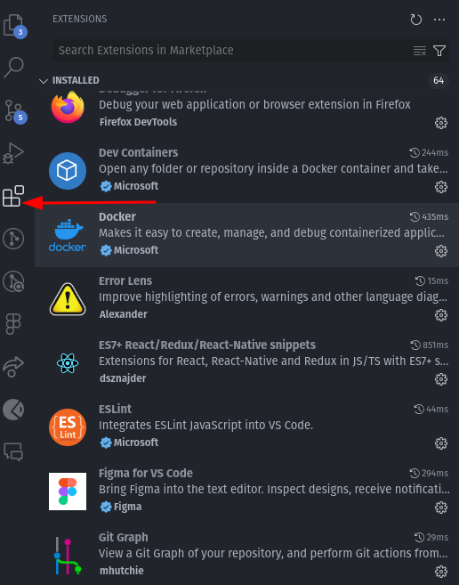

# Visual Studio Code per al Desenvolupament JavaScript

{ align=right width=300}

Visual Studio Code (VSCode) és una eina desenvolupada per Microsoft que es pot utilitzar en múltiples plataformes, com ara Windows, macOS i Linux. Ofereix funcions potents d'edició de codi, integració amb Git, compatibilitat amb molts llenguatges de programació i una extensa llibreria d'extensions per millorar la teva productivitat.

## Com Instal·lar Visual Studio Code

1. **Descarrega VSCode**: Vés al lloc web oficial de [Visual Studio Code](https://code.visualstudio.com/) i descarrega la versió adequada per al teu sistema operatiu.

2. **Instal·la VSCode**: Executa l'arxiu descarregat i segueix les instruccions del procés d'instal·lació.

3. **Obre VSCode**: Un cop instal·lat, obre Visual Studio Code des del teu menú d'aplicacions o fent clic a l'icòna a l'escriptori.

[{width=500}](https://www.youtube.com/watch?v=B-s71n0dHUk)

## Extensions Essencials per JavaScript

Aquí tens una llista d'extensions essencials per a Visual Studio Code (VSCode) que poden ajudar als aprenents a treballar amb desenvolupament front-end, incloent JavaScript, CSS, i HTML:

### Prettier - Code formatter
- **Funcionalitat:** Formatador automàtic del codi segons estàndards consistents.
- **Útil per:** Mantenir el codi net i llegible.

### ESLint
- **Funcionalitat:** Analitza el codi JavaScript per detectar i corregir errors. ESLint se centra en la qualitat del codi, identificant errors potencials i assegurant el seguiment de regles i estàndards de codi. Prettier, en canvi, se centra exclusivament en l'estil del codi, assegurant-se que sigui formatat de manera uniforme.
- **Útil per:** Assegurar la qualitat del codi seguint les regles de l'estil escollit.

### Live Server
- **Funcionalitat:** Obrir un servidor local per veure els canvis en temps real.
- **Útil per:** Accelerar el procés de desenvolupament visualitzant immediatament les actualitzacions.

### HTML CSS Support
- **Funcionalitat:** Autocompletat per a classes i identificadors CSS en HTML.
- **Útil per:** Facilitar la codificació HTML amb suggeriments de classes CSS existents.

### Path Intellisense
- **Funcionalitat:** Suggeriments automàtics per a rutes de fitxers i carpetes.
- **Útil per:** Estalviar temps i evitar errors quan s'especifica rutes.

### JavaScript (ES6) Code Snippets
- **Funcionalitat:** Ofereix snippets de codi per a ES6 JavaScript.
- **Útil per:** Escriure ràpidament estructures comunes de JavaScript.

### CSS Peek
- **Funcionalitat:** Visualitzar i navegar al codi CSS des del document HTML.
- **Útil per:** Millorar la comprensió de com el CSS afecta els elements HTML.

### Auto Close Tag i Auto Rename Tag
- **Funcionalitat:** Tancar automàticament etiquetes HTML i actualitzar-les simultàniament.
- **Útil per:** Accelerar el treball amb HTML i evitar errors amb etiquetes no tancades.

### Bracket Pair Colorizer
- **Funcionalitat:** Assigna colors a parelles de claudàtors per facilitar la lectura.
- **Útil per:** Identificar ràpidament les estructures de codi anidades.

### IntelliSense for CSS class names in HTML
- **Funcionalitat:** Autocompleta noms de classes CSS mentre escrius HTML.
- **Útil per:** Evitar errors tipogràfics en noms de classes i estalviar temps.

## Instal·lació de les Extensions
1. Obre VSCode.
2. Fes clic a la icona d'extensions a la barra lateral (un quadrat petit).
3. Busca el nom de l'extensió a la barra de cerca.
4. Instal·la l'extensió fent clic a "Install".

### **Instal·lació de les Extensions:**
{ align=right }

- Obre VSCode.
- Fes clic a la icona d'extensions a la barra lateral (un quadrat petit).
- Busca el nom de l'extensió a la barra de cerca.
- Instal·la l'extensió fent clic a "Install".

Aquestes extensions ajudaran els aprenents a començar amb les eines necessàries per a desenvolupar aplicacions front-end eficients i mantenibles, fent que el procés de desenvolupament sigui més fluid i agradable.

## Configuració Personalitzada

Pots personalitzar VSCode ajustant les opcions de configuració a les teves preferències. Per aconseguir-ho, obre la paleta de comandes amb `Ctrl + Shift + P`, busca "Preferences: Open Settings (JSON)" i personalitza el fitxer `settings.json` amb les teves preferències.

Aquesta configuració pot incloure la definició d'espais en blanc, el format de codi, els colors i moltes altres opcions que es poden adaptar a la teva manera de treballar.

## Prettier + ESlint: Configuració i Bones Pràctiques

Quan configures un projecte que utilitza Prettier i ESLint, és important establir algunes bones pràctiques mínimes en els fitxers de configuració per assegurar-te que el codi sigui consistent, net i fàcil de mantenir. A continuació, et proporciono exemples de configuració per a Prettier i ESLint, juntament amb algunes bones pràctiques que pots aplicar:

### Configuració de Prettier

Prettier no necessita moltes configuracions, ja que està dissenyat per ser una eina de formatació d'opinió. No obstant això, pots personalitzar alguns aspectes bàsics:

#### **`.prettierrc`**

```json
{
  "printWidth": 80,
  "tabWidth": 2,
  "useTabs": false,
  "semi": true,
  "singleQuote": true,
  "trailingComma": "es5",
  "bracketSpacing": true,
  "arrowParens": "avoid"
}
```

#### **Bones pràctiques per a Prettier:**

1. **Línia de màxima amplada (`printWidth`)**: Estableix a 80 per mantenir les línies de codi curtes i fàcils de llegir.

2. **Ús de cometes simples (`singleQuote`)**: Fomenta l'ús de cometes simples per a la consistència.

3. **Coma final (`trailingComma`)**: Utilitza `es5` per afegir comes finals en estructures de codi com arrays i objectes per millorar la diftusió de línies en revisions de codi.

### **Configuració d'ESLint**

ESLint és més flexible i pot ser ajustat a les necessitats específiques del teu projecte. Aquí tens una configuració bàsica que funciona bé amb Prettier:

#### **`.eslintrc.json`**

```json
{
  "env": {
    "browser": true,
    "es6": true,
    "node": true
  },
  "extends": [
    "eslint:recommended",
    "plugin:react/recommended",
    "plugin:@typescript-eslint/recommended",
    "prettier"
  ],
  "parser": "@typescript-eslint/parser",
  "parserOptions": {
    "ecmaVersion": 2020,
    "sourceType": "module"
  },
  "plugins": [
    "react",
    "@typescript-eslint"
  ],
  "rules": {
    "semi": ["error", "always"],
    "quotes": ["error", "single"],
    "no-unused-vars": "warn",
    "no-console": "warn",
    "react/prop-types": "off"
  }
}
```

#### **Bones pràctiques per a ESLint:**

1. **Integració amb Prettier**: Utilitza l'extensió `prettier` dins d'ESLint per evitar conflictes entre les regles de formatació d'ESLint i Prettier.

2. **Variables no utilitzades (`no-unused-vars`)**: Configura com a advertència per identificar variables declarades però no utilitzades.

3. **Ús de `console` (`no-console`)**: Configura com a advertència per evitar l'ús excessiu de `console.log` en codi de producció.

4. **Versió d'ECMAScript (`ecmaVersion`)**: Estableix a la versió més recent compatible amb el teu entorn per aprofitar les característiques modernes de JavaScript.

5. **Compatibilitat amb React**: Si utilitzes React, assegura't d'incloure `plugin:react/recommended` per tenir suport addicional.

6. **Tipuscript**: Si utilitzes TypeScript, assegura't de configurar el parser i les regles específiques per a TypeScript.

### **Configuració Addicional**

Per assegurar que Prettier i ESLint funcionin bé junts, pots afegir un script de NPM al teu `package.json` per a executar ambdues eines simultàniament:

#### **`package.json`**

```json
{
  "scripts": {
    "lint": "eslint . --ext .js,.jsx,.ts,.tsx",
    "format": "prettier --write \"src/**/*.{js,jsx,ts,tsx,json,css,md}\""
  }
}
```

### **Format Automàtic i Desat en VSCode**

Un cop tenim eines com Prettier i ESLint configurades, podem activar l'opció de formatar i desar automàticament el nostre codi. Això ens permetrà mantenir el codi net i ben format sense haver de preocupar-nos de fer-ho manualment.  

Per activar aquesta opció ho pots fer buscant a les opcions de configuració de VSCode o afegint les següents línies al teu `settings.json`:

```json
"editor.formatOnSave": true,
"editor.codeActionsOnSave": {
    "source.fixAll.eslint": true
}
```

Amb aquesta configuració, el teu codi es formatarà automàticament cada vegada que el desis, i els errors detectats per ESLint es corregiran automàticament.

Si vols que sigui Prettier qui formati el teu codi, pots afegir aquesta línia a la configuració:

```json
"editor.defaultFormatter": "esbenp.prettier-vscode",
```
