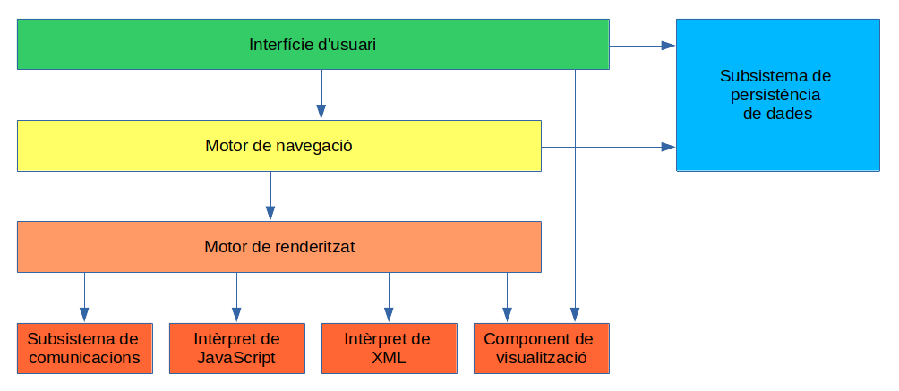

# Arquitectures i eines de programació

## Introducció a l'Arquitectura Web

L'arquitectura web és la base de tot el que experimentem mentre naveguem per internet. En aquesta introducció, explorarem a fons aquesta arquitectura, des de les seves arrels històriques fins als navegadors web moderns.

### Història i Evolució dels Navegadors

Els primers dies d'internet es caracteritzaven per la seva simplicitat. La web era principalment una col·lecció d'hipervincles i documents escrits en HTML que es mostraven de manera estàtica. Els primers navegadors com el Mosaic i el Netscape Navigator van ser pioners en la visualització d'aquests documents.

!!! info inline end "Comparativa navegadors Moderns"
    [Aqui pots consultar una gran quantitat de detalls sobre els principals navegadors en ús que trobaràs](https://eylenburg.github.io/browser_comparison.htm#)

La dècada dels 90 va veure la famosa "guerra dels navegadors" entre Netscape i Internet Explorer. Aquesta competència va portar a moltes innovacions i canvis en la manera en què es renderitzaven les pàgines web. A finals dels anys 90, Mozilla Firefox va sorgir com una alternativa de codi obert a Internet Explorer. Aquest navegador va portar la innovació i la seguretat a l'experiència de navegació.

Avui en dia, els navegadors web com Chrome, Firefox, Safari i Edge són els líders del mercat. Tots aquests navegadors utilitzen motors d'interpretació de JavaScript, com V8 (utilitzat per Chrome) o SpiderMonkey (utilitzat per Firefox), per processar i executar codi JavaScript a les pàgines web.

---

### Execució de codi en un navegador web

Els navegadors web segueixen una arquitectura bàsica comú a l'hora d'interactuar amb l'usuari i accedir als recursos web.

Tot i això, cada navegador pot prioritzar algun aspecte concret, per exemple:

- Oferir la resposta més ràpida.
- Mostrar la resposta més fidel al contingut.
- Incrementar la seguretat de les comunicacions.

Font: [Pàgina d'arquitectures E. Gallegos Trias](https://daw.institutmontilivi.cat/DAW-MP06/arquitectures.html)

???+ note "Arquitectura d'un Navegador Web"
    * **Interfície d'Usuari (UI):** L'interfície d'usuari és la part visible del navegador amb la qual els usuaris interactuen. Inclou elements com la barra d'adreces, botons de navegació i finestres emergents.

    * **Motor de Navegació:** El motor de navegació coordina les accions de l'usuari i la representació de la pàgina web a la pantalla. També gestiona diverses funcionalitats com la navegació enrere i endavant, les pestanyes i les finestres emergents.

    * **Motor de Renderització:** El motor de renderització és responsable de mostrar el contingut de les pàgines web a la pantalla. Aquest component interpreta el codi HTML, CSS i altres recursos per a renderitzar la pàgina web. És important destacar que hi ha diversos motors de renderització, incloent Trident (Internet Explorer), Blink (Google Chrome), Gecko (Firefox) i WebKit (Safari).

    * **Interpretació de JavaScript:** Aquest component és responsable d'executar codi JavaScript present a les pàgines web. Cada navegador utilitza el seu motor de JavaScript per a interpretar i executar els scripts. Alguns exemples de motors de JavaScript són V8 (Chrome), SpiderMonkey (Firefox) i JavaScriptCore (Safari).

    * **Gestió de Xarxa:** El navegador realitza sol·licituds a servidors web per a obtenir recursos com pàgines HTML, imatges, arxius CSS i JavaScript. La gestió de xarxa implica la resolució DNS, la creació de connexions i la recuperació de dades dels servidors.

    * **Memòria i Caché:** El navegador emmagatzema en memòria i en caché recursos per a millorar l'eficiència i la velocitat de càrrega de les pàgines web. La gestió de memòria és essencial per a evitar pèrdues de rendiment i bloquejos.

### Motors d'Interpretació de JavaScript

Destaquem alguns dels principals ==motors (d'interpretació) de JavaScript==, ja que són components essencials dels navegadors per l'execució del JavaScript. Aquests motors són responsables de convertir el codi JavaScript en accions i resultats visibles a les pàgines web.

| Nom del Motor        | Navegadors que ho Utilitzen   | Any d'Aparició | Informació Addicional                             |
|----------------------|-----------------------------|----------------|---------------------------------------------------|
| V8                   | Google Chrome, Opera        | 2008           | Desenvolupat per Google.                          |
| SpiderMonkey         | Mozilla Firefox             | 1995           | El motor original de JavaScript de Mozilla.       |
| JavaScriptCore (Nitro) | Safari                    | 2003           | Desenvolupat per Apple.                           |
| Chakra (abans)       | Internet Explorer           | 2008           | Utilitzat en versions antigues d'Internet Explorer. Abandonat en favor de V8 per a Microsoft Edge. |
| JavaScriptCore (JavaScriptCore) | Microsoft Edge (abans) | 2015      | Abandonat en favor de V8 per a Microsoft Edge.    |
| JavaScriptCore (WebKit) | Safari (abans)           | 2003           | Abandonat en favor de JavaScriptCore (Nitro) per a Safari. |

A continuació tens alguns recursos excepcionals que ens ajudaran a entendre els procés tècnic pel que ha de passar la lògica del nostre codi web (JS en particular) fins a executar allò pel que ha estat programat. No te'ls perdis!   

[JavaScript Engines - Filis Antillan](https://filisantillan.com/blog/js-engine/)

[Learn JavaScript Essentials - Lydia Hallie on DEV](https://dev.to/lydiahallie/series/3341)

