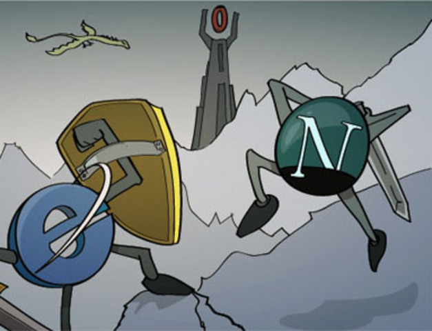
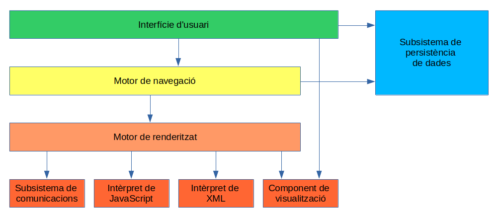

# Arquitectures

## Introducció a l'Arquitectura Web

L'arquitectura web és la base de tot el que experimentem mentre naveguem per internet. En aquesta introducció, explorarem a fons aquesta arquitectura, des de les seves arrels històriques fins als navegadors web moderns.

### Història i Evolució dels Navegadors

Els primers dies d'internet es caracteritzaven per la seva simplicitat. La web era principalment una col·lecció d'hipervincles i documents escrits en HTML que es mostraven de manera estàtica. Els primers navegadors com el Mosaic i el Netscape Navigator van ser pioners en la visualització d'aquests documents. 

La dècada dels 90 va veure la famosa "guerra dels navegadors" entre Netscape i Internet Explorer. Aquesta competència va portar a moltes innovacions i canvis en la manera en què es renderitzaven les pàgines web. A finals dels anys 90, Mozilla Firefox va sorgir com una alternativa de codi obert a Internet Explorer. Aquest navegador va portar la innovació i la seguretat a l'experiència de navegació.

Amb l'arribada dels smartphones i les tauletes, la web va evolucionar per a adaptar-se a les noves pantalles i dispositius. Això va portar a la popularització de navegadors mòbils com Safari i Chrome.

!!! info inline end "Comparativa navegadors Moderns"
    [Aqui pots consultar una gran quantitat de detalls sobre els principals navegadors en ús que trobaràs](https://eylenburg.github.io/browser_comparison.htm#)

Avui en dia, especialment Chrome, però també Firefox, Safari i Edge ocupen quasi tot el mercat de navegadors. Aquests navegadors moderns són molt més ràpids i s'asseguren d'implementar les últimes tecnologies web i seguir els estàndards que van marcan les darreres tecnologies (HTML5, CSS3 i JavaScript).

---

### Execució de codi en un navegador web

Els navegadors web segueixen una arquitectura bàsica comú a l'hora d'interactuar amb l'usuari i accedir als recursos web.

Tot i això, cada navegador pot prioritzar algun aspecte concret, per exemple:

- Oferir la resposta més ràpida.
- Mostrar la resposta més fidel al contingut.
- Incrementar la seguretat de les comunicacions.

Font: [Pàgina d'arquitectures E. Gallegos Trias](https://daw.institutmontilivi.cat/DAW-MP06/arquitectures.html)

??? "Arquitectura d'un Navegador Web"
    * **Interfície d'Usuari (UI):** L'interfície d'usuari dels navegadors, com Chrome, Firefox, Safari i Edge, proporciona els controls i les eines necessàries per navegar per la web. Tot i que l'aspecte pot variar entre navegadors, les funcions bàsiques com la barra d'adreces, botons de navegació i gestió de pestanyes són estàndards.

    * **Motor de Navegació:** Fa de pont entre la interfície d'usuari el motor de renderitzat. S'encarrega de comunicar als subsistemes inferiors l'adreça que l'usuari vol visitar perquè la descarreguin i la mostrin. Si el navegador suporta extensions, també són gestionades pel motor de navegació.

    * **Motor de Renderització:** Els motors de renderitzat són responsables de transformar el codi en contingut visible. Els engines més coneguts inclouen **Blink** per a Chrome i Opera, **Gecko** per a Firefox i **WebKit** per a Safari. Aquests motors processen HTML i CSS per generar l'arbre DOM i representar la pàgina visualment.

    * **Subsistema de Comunicació:** S'encarrega d'implementar els protocols de transferència de dades com HTTP, HTTPS, FTP i altres. Aquest subsistema permet la comunicació amb servidors web per obtenir recursos com pàgines web, imatges i arxius.

    * **Intèrpret de JavaScript:** L'intèrpret de JavaScript és una part integral del motor JavaScript del navegador (JS Engine). Engines com **V8** (Chrome), **SpiderMonkey** (Firefox), **Chakra** (Edge) i **JavaScriptCore** (Safari) interpreten i executen el codi, permetent la manipulació del DOM i la interactivitat de les pàgines web.
    
    * **Gestió de Xarxa:** El navegador realitza sol·licituds a servidors web per a obtenir recursos com pàgines HTML, imatges, arxius CSS i JavaScript. La gestió de xarxa implica la resolució DNS, la creació de connexions i la recuperació de dades dels servidors.

    * **Subsistema de Persistència de Dades (Memòria i Caché):** Aquest subsistema inclou tecnologies com les cookies, local storage i session storage per emmagatzemar dades localment en el navegador. Això permet als desenvolupadors mantenir dades entre sessions d'usuari i millorar la capacitat de resposta de les aplicacions web.

### Motors d'Interpretació de JavaScript

Destaquem alguns dels principals ==motors (d'interpretació) de JavaScript==, ja que són components essencials dels navegadors per l'execució del JavaScript. Aquests motors són responsables de convertir el codi JavaScript en accions i resultats visibles a les pàgines web.

| Nom del Motor        | Navegadors que ho Utilitzen   | Any d'Aparició | Informació Addicional                             |
|----------------------|-----------------------------|----------------|---------------------------------------------------|
| V8                   | Google Chrome, Opera        | 2008           | Desenvolupat per Google.                          |
| SpiderMonkey         | Mozilla Firefox             | 1995           | El motor original de JavaScript de Mozilla.       |
| JavaScriptCore (Nitro) | Safari                    | 2003           | Desenvolupat per Apple.                           |
| Chakra (abans)       | Internet Explorer           | 2008           | Utilitzat en versions antigues d'Internet Explorer. Abandonat en favor de V8 per a Microsoft Edge. |
| JavaScriptCore (JavaScriptCore) | Microsoft Edge (abans) | 2015      | Abandonat en favor de V8 per a Microsoft Edge.    |
| JavaScriptCore (WebKit) | Safari (abans)           | 2003           | Abandonat en favor de JavaScriptCore (Nitro) per a Safari. |

A continuació tens alguns recursos excepcionals que ens ajudaran a entendre els procés tècnic pel que ha de passar la lògica del nostre codi web (JS en particular) fins a executar allò pel que ha estat programat. No te'ls perdis!   

[JavaScript Engines - Filis Antillan](https://filisantillan.com/blog/js-engine/)

[Learn JavaScript Essentials - Lydia Hallie on DEV](https://dev.to/lydiahallie/series/3341)

