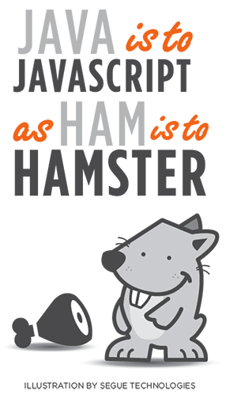

# Aplicació i verificació de la sintaxi del llenguatge

## JavaScript: Introducció a JS

El primer article d'aquesta guia ens explica breument què és **JavaScript** i la seva "relació" amb Java. També ens parla de la especificació **ECMAScript**, que és l'estàndard en el qual es basa JavaScript. La diferenciació ve perquè a partir de l'estàndard podrien crear-se diferents versions de JavaScript. Nosaltres veurem el JavaScript estàndard que funcionarà sense problemes en tots els navegadors moderns.

## JavaScript: Què és i quina és la seva relació amb Java?

JavaScript és un llenguatge de programació de scripts que s'usa principalment a les pàgines web. No té res a veure amb el llenguatge de programació Java, tot i que els noms són similars.

{ align=right }

| **Aspecte**              | **JavaScript**                                      | **Java**                                          |
|--------------------------|-------------------------------------------------|-----------------------------------------------|
| `Ús principal`                | Desenvolupament web i aplicacions de client.      | Àmpliament utilitzat en aplicacions d'empresa, desenvolupament d'aplicacions Android i servidors. |
| `Execució`                    | S'executa en el navegador del client.             | Requereix una màquina virtual Java (JVM).     |
| `Tipus de programari`         | Interpretat.                                      | Compilat a bytecode i després interpretat.   |
| `Portabilitat`                | Altament portàtil entre diferents navegadors.     | Portàtil a través de plataformes amb JVM.     |
| `Sintaxi`                     | Sintaxi més simple i flexible.                    | Sintaxi més rigorosa i verbosa.               |
| `Paradigma de programació`    | Suporta la programació orientada a objectes.      | Suporta múltiples paradigmes (OOP, procedimental, funcional). |
| `Llibreries i frameworks`     | Abundància de llibreries i frameworks per al desenvolupament web. | Ampli ecosistema d'entorns i llibreries.    |

## JavaScript: Tecnologia Front-End o Back-End?
{ align=left width=300}

==Front-End (Client-Side)==: En el front-end, **JavaScript** es fa servir per a la programació dels navegadors web. Aquesta funcionalitat s'ocupa de les interaccions d'un lloc web o aplicació web amb els usuaris en els seus navegadors. Amb **JavaScript**, pots crear dinàmicament elements **HTML**, gestionar esdeveniments com clics de ratolí i introduir animacions i efectes visuals. També pots fer sol·licituds **AJAX** per carregar dades sense necessitat de recarregar la pàgina web completa.

==Back-End (Server-Side)==: En el back-end, **JavaScript** pot ser utilitzat amb tecnologies com **Node.js** per a la creació de servidors i aplicacions web del costat del servidor. Amb **Node.js**, pots escriure codi **JavaScript** que s'executa al servidor en lloc de només al navegador. Això obre la porta a la creació de tot tipus d'aplicacions web, com aplicacions de xat en temps real, servidors d'aplicacions web i serveis web.

Ús General: **JavaScript** és un llenguatge de programació versàtil i pot ser utilitzat per a moltes aplicacions diferents, no només les relacionades amb la web. Pot ser utilitzat per al desenvolupament d'aplicacions mòbils amb el marc de treball **React Native**, la creació d'aplicacions de l'escritori amb l'ajuda d'**Electron** i fins i tot per a la programació d'Internet de les Coses (**IoT**).

## ECMAScript: L'Estàndard de JavaScript

ECMAScript (abreviat com a ES) es pot entendre com ==l'estàndard o especificació que defineix el llenguatge de programació JavaScript==. En altres paraules, JavaScript és la implementació concreta d'ECMAScript. L'ECMAScript estableix les regles i característiques fonamentals que han de ser presents en qualsevol implementació de JavaScript. Aquestes característiques inclouen la sintaxi del llenguatge, els tipus de dades, les funcions... 

L'estàndar ECMAScript 6 (o ECMAScript 2015), conegut també com a JavaScript 6, va ser una actualització significativa de JavaScript que va introduir moltes característiques noves i millores en el llenguatge. Algunes de les raons per les quals ECMAScript 6 va ser important inclouen:

- **Noves Característiques clau** 

- **Millora de la Llegibilitat** 

- **Compatibilitat entre Navegadors**

- **Suport a les Últimes Novetats:**

## Referències i recursos addicionals ##
- [MDN: Introducció a JavaScript a la documentació de Mozilla](https://developer.mozilla.org/es/docs/Web/JavaScript/Guide/Introduction)
- [Especificació ECMAScript](https://tc39.es/ecma262/)
- [Top ES6 JS contributions](https://webreference.com/javascript/es6/)

