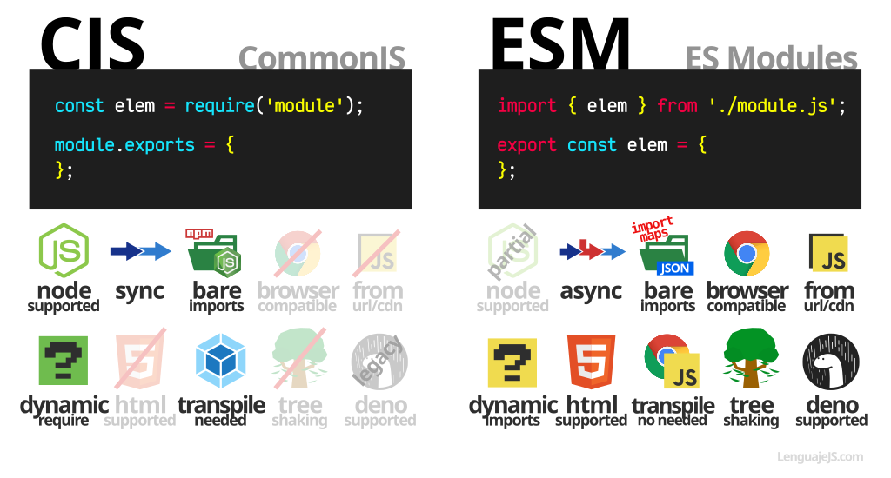

#Modules (Programació modular)

## Què són els mòduls?

Els mòduls són peces de codi reutilitzables en un fitxer que es poden exportar i, posteriorment, importar per utilitzar-les en un altre fitxer. Un programa modular és aquell on els seus components es poden separar, utilitzar de manera individual i recombinar per crear un sistema complex.

Imagina un programa com el que es mostra a continuació, escrit en un fitxer anomenat **my_app**.js:

En lloc d'escriure tot el programa dins de my_app.js, els seus components són dividits en mòduls separats que gestionen tasques específiques. Per exemple, el mòdul **database_logic**.js pot contenir el codi per emmagatzemar i recuperar dades d'una base de dades. Mentre que el mòdul **date_formatting.js** pot contenir funcions dissenyades per convertir fàcilment valors d'un format/tipus a un altre (una tasca comuna entre programadors).

## Implementacions de Mòduls a JavaScript: Node.js vs. ES6


Abans de començar, cal destacar que hi ha múltiples maneres d'implementar mòduls segons l'entorn d'execució en el qual el teu codi s'estigui executant. A JavaScript, hi ha dos entorns d'execució principals i cadascun té una implementació de mòduls preferida:

1. L'entorn d'execució de Node i la sintaxi `module.exports` i `require()`.
2. L'entorn d'execució del navegador i la sintaxi d'importació/exportació ES6.

Certament, aquí tens l'explicació anterior amb les parts de codi clarament separades i identificades:

**Què són els mòduls?**
Els mòduls són peces de codi reutilitzables en un fitxer que es poden exportar i, posteriorment, importar per utilitzar-les en un altre fitxer. Un programa modular és aquell on els seus components es poden separar, utilitzar de manera individual i recombinar per crear un sistema complex.

```javascript
// Exemple d'un programa modular
const converters = require('./converters.js');

const freezingPointC = 0;
const boilingPointC = 100;

const freezingPointF = converters.celsiusToFahrenheit(freezingPointC);
const boilingPointF = converters.celsiusToFahrenheit(boilingPointC);

console.log(
  `El punt de congelació de l'aigua en graus Fahrenheit és ${freezingPointF}`
);
console.log(
  `El punt d'ebullició de l'aigua en graus Fahrenheit és ${boilingPointF}`
);
```

### Implementant Mòduls a Node

Cada fitxer JavaScript que s'executa en un entorn de Node es tracta com un mòdul independent. Les funcions i les dades definides dins de cada mòdul poden ser utilitzades per qualsevol altre mòdul, sempre que aquests recursos siguin exportats i importats correctament.

```javascript
// Exemple de mòdul que exporta funcions
function celsiusToFahrenheit(celsius) {
  return celsius * (9 / 5) + 32;
}

module.exports.celsiusToFahrenheit = celsiusToFahrenheit;

module.exports.fahrenheitToCelsius = function (fahrenheit) {
  return (fahrenheit - 32) * (5 / 9);
};
```

```javascript
// Exemple d'ús de require() per importar funcions d'un mòdul
const { celsiusToFahrenheit } = require('./converters.js');

const celsiusInput = process.argv[2];
const fahrenheitValue = celsiusToFahrenheit(celsiusInput);

console.log(
  `${celsiusInput} graus Celsius = ${fahrenheitValue} graus Fahrenheit`
);
```

Amb aquest enfocament modular, les funcions poden ser compartides i utilitzades en diferents parts del teu programa, evitant la duplicació de codi i millorant la gestió de projectes.

### ES6 (EcmaScript 2015)

Amb la sintaxi ES6, es poden exportar i importar funcions i dades utilitzant les paraules clau `export` i `import`. Aquí tens un exemple:

```javascript
// Exemple de mòdul que exporta funcions amb ES6
export function celsiusToFahrenheit(celsius) {
  return celsius * (9 / 5) + 32;
}

export function fahrenheitToCelsius(fahrenheit) {
  return (fahrenheit - 32) * (5 / 9);
}
```

```javascript
// Exemple d'ús d'importació amb ES6
import { celsiusToFahrenheit } from './converters.js';

const celsiusInput = process.argv[2];
const fahrenheitValue = celsiusToFahrenheit(celsiusInput);

console.log(
  `${celsiusInput} graus Celsius = ${fahrenheitValue} graus Fahrenheit`
);
```

Amb aquest enfocament, les funcions es poden exportar directament amb l'ús de `export` i importar amb l'ús de `import`.

Aquest és el mètode preferit per a la gestió de mòduls en aplicacions web modernes i és compatible amb molts entorns de desenvolupament i eines de construcció de paquets com Webpack, Parcel, Babel...

###Referències

[CommonJS vs ES Modules](https://lenguajejs.com/automatizadores/introduccion/commonjs-vs-es-modules/)
